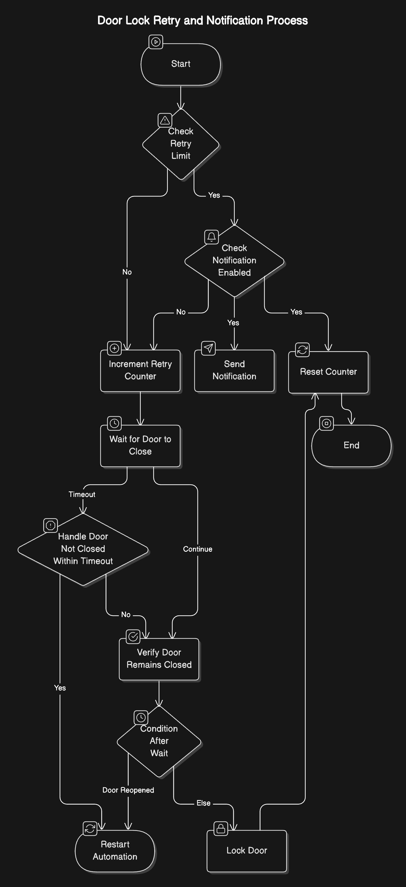

# Lock Door with Retry Limit and Custom Timeouts


## Overview

**Lock Door with Retry Limit and Custom Timeouts** is a Home Assistant automation blueprint designed to ensure your door remains securely locked. This automation monitors the state of your door lock and door sensor to maintain security. If the door fails to stay closed, the automation will attempt to lock it multiple times (up to a defined retry limit). After exceeding the maximum retries, it can send you a notification, allowing you to take further action. This blueprint offers customizable timeouts and integrates seamlessly with your existing Home Assistant setup.

---

## Features

- **Automatic Locking:** Ensures your door is locked whenever it's unlocked.
- **Retry Mechanism:** Attempts to re-lock the door multiple times if it doesn't stay closed.
- **Customizable Timeouts:** Define how long to wait for the door to close and verify its state.
- **Notifications:** Receive alerts after exceeding retry limits.
- **Counter Integration:** Keeps track of retry attempts using Home Assistant Helpers.
- **Flexible Configuration:** Easily adjust parameters to fit your specific needs.

---

## Table of Contents

- [Prerequisites](#prerequisites)
- [Installation](#installation)
- [Configuration](#configuration)
- [Usage](#usage)
- [Diagram](#diagram)
- [Contributing](#contributing)
- [License](#license)

---

## Prerequisites

Before setting up this automation, ensure you have the following:

- **Home Assistant:** Installed and running. ([Installation Guide](https://www.home-assistant.io/installation/))
- **Lock Device:** A compatible smart lock integrated with Home Assistant.
- **Door Sensor:** A binary sensor (e.g., door/window sensor) that detects open/closed states.
- **Helpers:** Ability to create and manage Helpers in Home Assistant.

---

## Installation

### Counter variable

**Create the Counter Helper:**
- Go to **Settings** > **Devices & Services** > **Helpers** in your Home Assistant UI.
- Click **Add Helper** and choose **Counter**.
- Name the counter `door_lock_retries` (this is the default name used by the blueprint).

### Import
  - In Home Assistant, go to **Settings** > **Automations & Scenes** > **Blueprints**.
  - Select **Import Blueprint** and enter the url [https://raw.githubusercontent.com/garnser/homeassistant-blueprints/refs/heads/main/door_contact_sensor/door_contact_sensor.yaml](https://raw.githubusercontent.com/garnser/homeassistant-blueprints/refs/heads/main/door_contact_sensor/door_contact_sensor.yaml) to the blueprint.
  - Select **Preview** > **Import**

### Manual
1. **Clone the Repository:**
   ```bash
   git clone https://github.com/garnser/homeassistant-blueprints.git
   ```
2. **Add the Blueprint:**
  - Navigate to your Home Assistant configuration directory.
  - Place the `door_contact_sensor/lock_door_with_retry.yaml` file into the `blueprints/automation/` directory. If the directories don't exist, create them.
   ```bash
   mkdir -p /config/blueprints/automation/lock_door/
   cp lock_door_with_retry.yaml /config/blueprints/automation/lock_door/
   ```

---

## Configuration
### Blueprint Inputs
When adding the automation, you'll need to configure the following inputs:

| Input | Description | Type | Default |
|----|----|----|----|
| `door_lock` | The lock device to control. | Lock entity | *None* |
| `door_sensor` | The door sensor to monitor (must detect open/closed states). | Binary sensor | *None* |
| `counter_variable` | The counter variable created using Helpers. | Text | `counter.door_lock_retries` |
| `max_retries` | The maximum number of attempts to lock the door before sending a notification. | Number (1-10) | `3` |
| `enable_notification` | Whether to send a notification after reaching the maximum retry attempts. | Boolean | `false` |
| `notification_device`	 | The notification service to use (e.g., notify.mobile_app_your_device). | Text | `""` (empty string) |
| `door_close_timeout` | Time to wait for the door to close initially, in seconds. | Number (=> 5) | `30` |
| `verification_timeout` | Time to ensure the door remains closed, in seconds. | Number (=> 5) | `30` |

### Steps to Configure
1. **Add the Automation:**
  - In Home Assistant, go to **Settings** > **Automations & Scenes** > **Blueprints**.
  - Select `Lock Door with Retry Limit and Custom Timeouts`
  - Fill in the required inputs as per your setup.
  - Select `SAVE`
2. **Configure Each Input:**
  - **Door Lock:** Select your smart lock entity (e.g., `lock.front_door`).
  - **Door Sensor:** Select your door sensor entity (e.g., `binary_sensor.front_door`).
  - **Counter Variable:** Use the default `counter.door_lock_retries` or specify another if you created a different helper.
  - **Max Retries:** Set the number of retry attempts (default is `3`).
  - **Enable Notification:** Toggle to `true` if you want to receive notifications.
  - **Notification Device:** Specify your notification service (e.g., `notify.mobile_app_your_device`). Leave empty to use the default `notify.notify`.
  - **Door Close Timeout:** Set the initial wait time for the door to close (default is `30` seconds).
  - **Verification Timeout:** Set the time to verify the door remains closed (default is `30` seconds).
3. **Save the Automation:**
  - After configuring all inputs, save the automation. It will now be active and ready to monitor your door lock.

---

## Usage
Once installed and configured, the automation works as follows:

1. **Trigger:** When the specified door lock changes to the "unlocked" state.
2. **Retry Mechanism:**
  - Checks if the retry count has reached the maximum limit (`max_retries`).
  - If the limit is reached and notifications are enabled, it sends a notification.
  - Resets the retry counter.
  - If the limit is not reached, it increments the retry counter.
3. **Door Monitoring:**
  - Waits for the door to close within the `door_close_timeout` period.
  - If the door doesn't close in time, the automation restarts.
4. Verification:
  - After the door closes, it waits for the `verification_timeout` to ensure the door remains closed.
  - If the door reopens during verification, the automation restarts.
  - If the door stays closed, it locks the door and resets the counter.

**Automation Mode:** `restart` – ensures that the automation restarts its sequence if triggered again while already running.

---

## Diagram



---

## Contributing
Contributions are welcome! If you have suggestions, bug reports, or enhancements, please open an issue or submit a pull request.

---

## License
This project is licensed under the [MIT License](/door_contact_sensor/LICENSE).

For any queries or support, feel free to reach out via [GitHub Issues](https://github.com/garnser/homeassistant-blueprints/issues).
